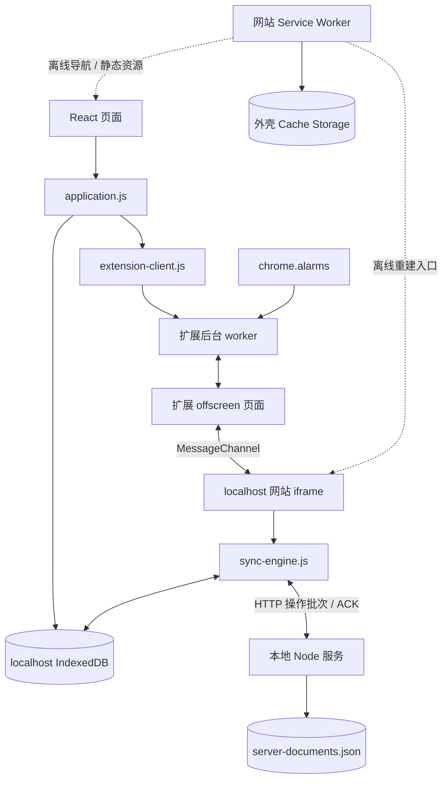
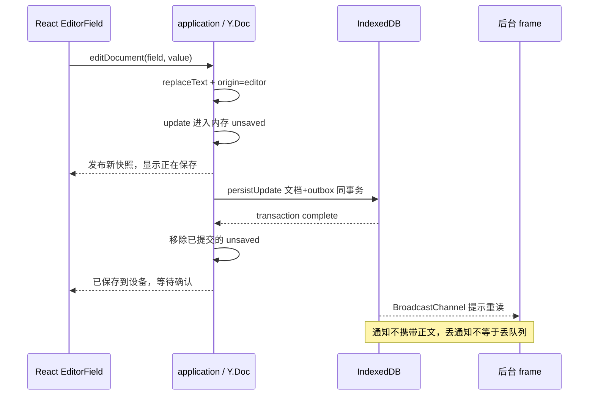

# Offline Docs Demo：功能设计、模块职责与核心链路

更新：2026-09-21。本文解释本仓库当前 React Demo 的实际实现，不推断 Google 未公开的编辑器或服务端协议。运行方式见 [Demo README](../README.md)，精简架构见 [ARCHITECTURE](ARCHITECTURE.md)，React 细节见 [REACT](REACT.md)。

推荐先读第 2 节的职责表，再跟第 5–7 节走完“编辑 → 本地提交 → 扩展调度 → 服务端 ACK”。第 8–10 节用于理解并发、故障与调试。

## 1. Demo 要验证什么

目标不是只做一个断网后还能显示的页面，而是验证三件事：应用能离线启动；编辑能先可靠地保存在设备；扩展能够唤起同源执行环境，把持久化操作同步到服务端。

| 功能 | 当前设计 | 明确边界 |
| --- | --- | --- |
| 文件列表与搜索 | 列表先读 IDB，联网补充服务端元数据；按标题和本地可用状态筛选 | 云端列表存在不等于正文已下载 |
| 打开与固定 | 已缓存文档直接打开；未缓存时下载并合并；pin 表示保留意图 | 取消固定不删除正文；没有自动空间淘汰 |
| 离线新建 | 本机生成 UUID，将初始 Yjs 状态和 outbox 同事务提交 | 不需要先申请服务端 ID；采用固定演示账号 |
| 纯文本编辑 | React 受控输入 → Y.Text 局部变化 → Yjs update | 非富文本，没有评论/附件/共享 |
| 自动保存 | 本地提交成功后显示已保存到设备；队列等待 ACK | React state 与内存 Y.Doc 本身不是持久化存储 |
| 后台同步 | 共享扩展创建 offscreen，嵌入 localhost frame 执行同步 | 页面不直接上传；浏览器退出后不能继续执行 |
| 离线导航 | 网页 SW 缓存 React 外壳和 frame 外壳；正文来自 IDB | 首次使用仍需资源准备；不保证任意未下载文档离线打开 |
| 诊断与模拟断网 | 显示队列、握手、缓存和日志；IDB 开关约束所有 Demo API | 只是模拟请求阻断，不等于操作系统全局断网 |

## 2. 模块职责：谁负责什么，谁不能越界

| 模块 / 入口 | 输入与输出 | 负责 | 不负责 |
| --- | --- | --- | --- |
| [app.jsx](../src/app.jsx) | 挂载 React，调用 `boot()`，导出测试动作 | 网页入口与可选 WebMCP 注册 | 文档合并与后台上传 |
| [react/](../src/react/) | 应用快照 → JSX；控件事件 → 应用动作 | 列表、编辑、设置、输入体验与状态展示 | 直接写 IDB 或向服务端提交操作 |
| [application.js](../src/application.js) | UI/路由/广播事件 → 模型、事务、调度请求 | 当前编辑会话、状态发布、内存待写队列、扩展启用 | 控制 DOM、实现服务端去重 |
| [crdt.js](../src/core/crdt.js) | 字符串/二进制 update ↔ Y.Doc | 局部文本变化、快照和 Base64 编解码 | 网络发送、数据提交时机 |
| [database.js](../src/core/database.js) | 更新/ACK → IndexedDB 事务 | 文档快照、outbox、控制状态、诊断日志的唯一读写入口 | 发 HTTP 请求、判断服务器已保存 |
| [extension-client.js](../src/core/extension-client.js) | 网页动作 → 原数组协议消息 | 扩展探测、启用、停用、请求同步及超时/错误转换 | 真正执行 `syncAll()` |
| [Demo adapter](../extension/adapter/background.js) + [共享控制器](../../src/background/extension-controller.js) | runtime 消息/alarm → 状态与隐藏页管理 | 复用扩展控制流、切换本地域名和诊断指纹 | 存正文、理解 Yjs update |
| [共享 offscreen](../../src/offscreen/offscreen-controller.js) | worker 消息 ↔ iframe 端口 | iframe 创建、握手、消息转发、生命周期 | 网页路由缓存、文档业务合并 |
| [frame.js](../src/frame.js) | 握手/RPC/广播/恢复联网 → 同步任务 | 网站同源后台入口，持有原协议的 MessageChannel | 显示 React UI、伪装为 Google 后端 |
| [sync-engine.js](../src/core/sync-engine.js) | 持久化队列 → HTTP → ACK 事务 | 同步互斥、分批、响应校验、错误状态 | 编辑器 DOM、扩展生命周期 |
| [service-worker.js](../src/service-worker.js) | 网站导航/静态 GET → 缓存响应 | 离线外壳启动和版本化资源 | 上传、ACK、outbox、协同冲突解决 |
| [server/index.mjs](../server/index.mjs) | HTTP → 页面资源/存储调用 | 路由、请求边界、静态文件、故障注入 | 真正的账号认证和权限系统 |
| [server/store.mjs](../server/store.mjs) | 操作批次 → 合并状态与 ACK | 串行修改、operation ID 回执、落盘后确认 | 浏览器事务、多个服务器之间的协调 |
| [scripts/build.mjs](../scripts/build.mjs) | workspace 源码/资源 → 网站与派生扩展 | 编译、来源指纹、Demo 专用安全适配、外壳版本 | 修改共享源码、复制旧 upstream 快照 |

`application.js` 可以用 `api()` 下载列表和尚未缓存的文档；“前台不上传”不意味着前台完全不访问服务端。所有 `syncAll()` 调用都在网站 frame 中，这是本 Demo 验证扩展参与实际工作的设计选择。

## 3. 运行环境与数据归属

- React 页面和 frame 的 origin 都是 `http://localhost:4173`，使用同一个站点数据库。该共享结果已有真实浏览器集成测试，不能仅凭 iframe 存在就推断任意跨站场景均相同。
- offscreen 自身属于 `chrome-extension://ikiiibboenfblpmpholjlkmbbnkichpo`，与内嵌 frame 不同源。它通过端口通信，而不是直接读网站正文。
- 扩展 `chrome.storage` 保存启用状态、账号标记、握手时间等控制信息，不是文档数据库。
- 网页 SW 处理网站请求；扩展 worker 接收扩展消息与 alarm。二者没有“谁替代谁”的关系。
- Cache Storage 保存程序能否启动所需的响应；IDB 保存程序启动后要恢复的文档和队列。只缓存其中一个都不等于完整离线可用。

## 4. 数据模型与四种状态

数据库名称：`OfflineDocsDemo-v1`；当前 schema 版本：1。

| 存储 | 关键字段 | 用途 |
| --- | --- | --- |
| `documents`，键 `id` | `state`、`title`、`body`、`cached`、`pinned`、`updatedAt` | Base64 Yjs 全量状态及其派生文本；标题/正文用于显示，CRDT state 才是合并依据 |
| `outbox`，键 `id` | `documentId`、`update`、`createdAt` | 已提交但未被服务端确认的操作；`id` 即重试时复用的 operation ID |
| `meta`，键 `key` | `simulateOffline`、`extensionEnabled`、`frameHandshake`、`syncStatus` | 同源各上下文共享的开关、连接观察与同步结果 |
| `events`，自增 `id` | `at`、`type`、`detail` | 有限数量的诊断事件，非可靠任务队列 |
| 服务端 `documents[id]` | `state`、`version`、`updatedAt`、`receipts` | 合并状态与 `operation ID → payload hash` 回执，共同保存在 JSON 文件 |

客户端 ACK 后另记录 `serverVersion`、`syncedAt`；下载响应可能带 `version`。这些字段用于记录观察到的服务端版本，不是 Demo 自行实现 OT 变换的 base revision。

保存状态必须分清：

1. **输入法草稿**：组件 `draft` 与组合输入分支，仅在内存，未承诺可恢复。
2. **`unsaved`**：Y.Doc 已变化，但本地事务尚未完成或失败；页面关闭可能丢失，必须提示。
3. **`outbox`**：本地事务成功，刷新可恢复；服务端是否收到仍未知。
4. **收到并提交 ACK**：明确确认的操作从 outbox 删除。表示本地操作获得确认，不等于永远拥有其它客户端的最新状态。

“扩展可探测”“启用意图已保存”“观察过 frame 握手”也是不同维度。`frameHandshake` 是历史观察时间，不是持续心跳租约；隐藏页回收后旧记录仍可能存在。`shellReady` 来源于网页 SW ready，也不是完整文档依赖检查或存储永不被驱逐的保证。

## 5. 启动、打开与本地编辑链路

### 5.1 启动与打开

`app.jsx → boot() → readState() → route()` 优先使用本地数据，同时注册网页 SW；随后尝试补充服务端列表、探测扩展并按站点启用记录恢复连接。`bootPromise` 确保初始化只有一份，不随 React 渲染重复启动监听和定时器。

点击文档后，`openDocument()` 先尝试提交 `unsaved`，再调用 `ensureCached()`：已有快照直接恢复 Y.Doc，否则下载并通过事务与本地状态合并。`routeEpoch` 防止较慢的旧打开请求覆盖更新的路由；`readEpoch` 避免旧的异步状态读取回写过时 UI。

`mergeCatalog()` 不覆盖已缓存文档的本地正文和标题，防止云端列表的旧元信息把未同步编辑覆盖掉。离线打开从未缓存的文件会显示不可用原因，不创建一份空白正文冒充成功。

### 5.2 一次输入到底经过哪里

`replaceText()` 通过公共前后缀缩小修改区间，尽量保留未改变字符的 CRDT 身份；这是纯文本输入适配，不是通用 diff。`origin === "editor"` 的更新才追加本地操作；刷新从 IDB 合入的 remote update 不应重新进入 outbox。

`persistUpdate()` 在同一个 readwrite 事务里读取数据库最新快照，合入本次 update，写文档并追加操作。它不是把当前页面的旧全文直接覆盖回数据库，所以能保留另一标签已提交的修改。必须等事务 `complete`，而非某一次 `put.onsuccess`，才能从 `unsaved` 删除。

组合输入期间另保留起始 Y.Doc/state vector。结束时生成该分支新增的 update 再合入当前 Y.Doc，避免远端修改被候选文字覆盖。光标保存为 Yjs relative position，在 React 提交新 value 后恢复；详见 [EditorField](../src/react/EditorField.jsx)。

## 6. 扩展握手与请求转发

### 6.1 为什么需要隐藏网站 frame

扩展 worker 负责可恢复调度，offscreen 提供隐藏 DOM，网站 iframe 提供网站 origin 的业务执行环境。Demo 只适配原控制器的 origin、遥测和来源边界，实际仍复用其状态、握手、重建和生命周期逻辑。

握手次序：

1. 网页 `enableOffline()` → `connectExtension()`，向独立 Demo ID 发外部 type 2。
2. 共享 worker 保存控制状态，`OffscreenManager` 创建/确保隐藏页，再发内部 type 6。
3. offscreen 创建 `/offline/extension/frame?ouid=local-demo-account`，由网页 SW 或服务端提供 frame 外壳。
4. `frame.js` 发 type 1，并转移两个端口：一个接收此次握手回复，一个保留供后续 RPC 使用。
5. offscreen 回传内部 type 3，worker 解除真实 `frameReady` 等待；frame 收到自己的回复后记录站点握手并尝试初次同步。

不同通道相同数字不是同一枚举。详细数组定义参见 [共享协议](../../docs/PROTOCOL.md)。

| 发起方 / 消息 | 本 Demo 的使用方式 |
| --- | --- |
| 网页 type 5 | 查询策略，用作扩展响应探测；不证明后台 frame 存在 |
| 网页 type 2 | 请求启用/确保 frame，载荷带固定演示账号 |
| 网页 type 3 | 请求退出；停止扩展调度，不清空网站本地数据 |
| 网页 type 4 + 内层 type 0 | 显式同步请求经扩展转发为 frame alarm RPC |
| frame 回复 `[0]` | 原数组通道完成回复；**不是服务端 ACK** |
| HTTP 响应 `ack: [operationId...]` | 具体业务操作的接收确认，经本地事务后才能清除队列 |

`frame.js` 的同步失败路径仍回 `[0]`，具体错误由 `syncAll()` 写入 `meta.syncStatus`。因此手动同步动作在 RPC 完成后还会读取 `syncStatus.error`；不能只凭扩展回了消息就显示“所有修改已上传”。握手也不等于网络可达或本轮同步成功。

### 6.2 谁在何时触发同步

| 触发源 | 当前配置 | 生命周期限制 |
| --- | --- | --- |
| 编辑后前台请求 | 700ms 防抖后请求扩展 | 页面关闭后定时器消失 |
| 前台周期检查 | 15 秒刷新并请求同步 | 不是扩展 alarm 周期 |
| frame 本地通知 | `document/resume` 事件后 600ms 防抖 | 仅在 frame 已存在时有效 |
| frame 握手成功 / online | 尝试一次同步 | 仍须通过模拟断网检查与同步锁 |
| 共享扩展 heartbeat | 默认 5 分钟 | 调度可能延迟，不保证准时 |
| 手动点击同步 | 立即请求共享扩展转发 | 未启用或离线时提示原因 |

多个触发源可以交错，不要求网络请求与每次键入一一对应。共享 offscreen 还有 60 秒空闲/1 小时上限与重建路径；这些配置不是常驻保证。恢复能力依靠持久化队列，而不是依靠某个 Promise、端口或页面永不退出。

## 7. 上传、合并、ACK：完整闭环

`frame.js → syncAll() → api() → POST /api/documents/:id/sync → DocumentStore.sync() → acknowledge()`。

1. **取得本地同步锁**：`navigator.locks.request(..., { ifAvailable: true })`，没拿到就跳过，避免触发器堆积。锁只协调同源同步者，不代替跨标签写事务或跨设备 CRDT。
2. **读取本轮队列**：取出 outbox 快照，按文档分组、按最多 200 条及 Base64 长度约 1.5MB 分批。这个长度不是完整 HTTP body 的精确上限，服务端另校验请求大小。
3. **发送原有操作身份**：载荷是 `{account, operations: [{id, update}]}`，重试不生成新 ID。即使没有操作，也为已缓存文档发送空批次，借响应拉取远端状态。
4. **服务器串行合并**：基于整库副本校验每个 operation ID 与 payload hash。同 ID/同内容直接确认；同 ID/不同内容返回 409。新操作用 Yjs 合并，不用全文覆盖。
5. **落盘后 ACK**：服务端将 CRDT 状态与回执一起写临时 JSON，再 rename 成正式文件；成功后更新内存状态并返回 `{state, version, ack, ...}`。单进程队列串行化整库写入；失败不推进正式内存状态。
6. **客户端校验响应**：ACK 中的 ID 必须属于本批实际发出的集合，不能凭响应删除其它操作。
7. **原子推进本地状态**：ACK 事务重新读取此刻最新文档，合入远端 CRDT 状态，只删除明确确认的 ID，再通知页面重读。

关键例子：请求携带操作 A 发出后，用户又编辑得到 B。服务端只确认 A，则本地把服务端状态与包含 B 的最新快照合并，只删除 A；B 留在 outbox。禁止用旧响应覆盖全文，也禁止整个队列 `clear()`。

服务端已提交而 ACK 丢失时，客户端仍保留 A，使用同一 ID 重试，持久化回执返回确认但不重复应用。若客户端收到 ACK 后尚未提交本地事务就退出，也可以用同样机制恢复。这是幂等与持久化配合的结果，不是请求“恰好只发送一次”。

## 8. 三类并发协调，不要混用

- **页面内异步并发**：`writePromise` 串行排空 `unsaved`，epoch 抑制过时结果；React snapshot 通知 UI。
- **同浏览器多上下文**：IDB readwrite 事务保护文档/outbox 一致性；Web Locks 减少同步执行者竞争；BroadcastChannel 仅通知重新读取，不能提供事务保证。
- **服务端与跨客户端**：Yjs 合并操作；operation ID 回执处理请求重试；Node 队列防止单进程整库写入丢更新。它不具备多个服务进程之间的锁。

广播消息丢失不会删除操作，因为正文和队列已经在事务中提交，后续打开、刷新或 heartbeat 仍可读取。广播更像刷新提示，不应被改成唯一可靠任务来源。

## 9. 故障和能力边界

| 情况 | 当前行为 | 不应做什么 |
| --- | --- | --- |
| IDB 写入失败 | 回滚文档/outbox，保留内存队首并提示重试/不要关页 | 虚报已保存、丢弃队首 |
| HTTP 不可达 | 保留 outbox，写同步错误，等待后续触发 | 将 `navigator.onLine` 当作服务可达保证 |
| ACK 丢失 | 原 ID 重试，服务端回执去重 | 重新生成操作 ID 或先清空队列 |
| 远端更新与本地编辑重叠 | CRDT 合并；ACK 事务读最新本地状态 | 最后返回的整篇 JSON 覆盖正文 |
| offscreen 被回收 | 下一次扩展事件有机会重建并重读持久队列 | 认为关页后必须永久保活 |
| 缺少扩展 | 可本地编辑保存，不能通过此 Demo 链路上传 | 在前台悄悄替代上传以伪造验证成功 |
| 服务端文件损坏 | 启动报错；只在文件不存在时初始化样例 | 静默重建空库覆盖原数据 |
| 版本切换 | 新壳缓存名；简单立即激活并回收旧壳 | 把它当作完成生产级多版本/数据库迁移 |

服务只监听 loopback，Host/Origin 检查与固定账号字段不是身份认证。暂不支持多租户、多账号撤权、富文本附件、长期回执裁剪、增量拉取游标或分布式存储。JSON rename 也不是已验证的断电/fsync 保证。

## 10. 阅读、调试和修改建议

阅读顺序：`app.jsx → react/App.jsx → application.editDocument/flushLocalWrites → database.persistUpdate → extension-client.requestSync → frame.js → sync-engine.syncAll → server/store.sync → database.acknowledge`。

推荐断点与观察对象：

- 输入后没有本地保存：看 `unsaved`、`writePromise`、IDB `complete/abort`，不要先排查网络。
- 扩展看似启用却没同步：分别查 `detectExtension()`、实际 offscreen context、握手时间、原 `frameReady`；旧握手记录不是活跃证明。
- 队列不减少：检查 `syncStatus`、HTTP 响应的 `ack` 与本批 ID、ACK 本地事务是否提交。
- 光标跳动或输入法覆盖：检查 `EditorField` 的相对位置与组合分支，不应靠整体重挂载输入框修复。
- 页面断网打不开：先查 SW scope/激活、外壳缓存和请求路由，再查文档 `cached/state`；程序资源和正文是两层。

修改时保持边界：UI 改 `react/`；编辑与状态编排改 `application.js`；数据不变量改 `database.js` 并补故障用例；调度适配改 Demo adapter/构建层，不能无意改变 Google 目标的共享语义。

在根目录运行 `pnpm check`、`pnpm test:integration`。现有 22 项扩展差分、7 项 Demo 检查、12 条浏览器路径的范围见 [VALIDATION](VALIDATION.md)。完整 Google 服务端验收与这些本地实验不同，不应混为同一结论。
