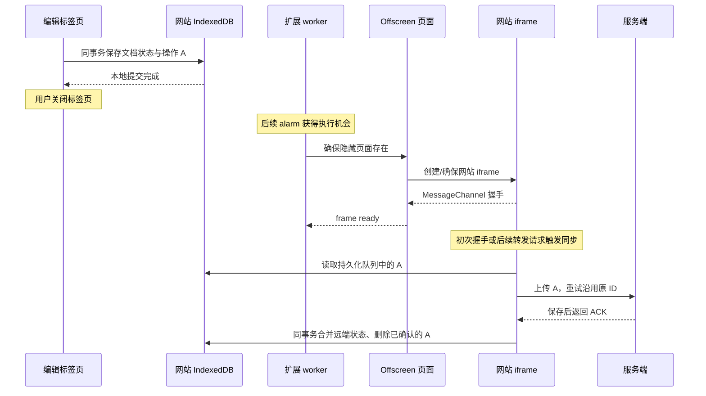

# 为什么离线方案中需要 Offscreen：从关闭文档后的同步说起

更新：2026-09-21。本文用当前 Demo 解释设计动机，再对应共享扩展源码。案例不是对 Google 私有同步协议的还原，也不代表所有离线应用都需要扩展。

## 1. 先认识 offscreen

Offscreen Document 是扩展通过 Chrome API 创建的隐藏 HTML 页面：有 `window`、`document` 和 DOM，但不出现在标签栏。扩展后台 Service Worker 没有 DOM；需要创建 iframe 时，可以让 offscreen 承担这一工作。

创建入口必须是扩展包内的 HTML，manifest 需要 `offscreen` 权限。它可以使用网页 API，但扩展 API 仅支持 `chrome.runtime`；它不是普通网站可以自行创建的后台页面。[Chrome Offscreen API](https://developer.chrome.com/docs/extensions/reference/api/offscreen)

先记住三个角色：**worker 负责调度，offscreen 提供隐藏 DOM，网站 iframe 执行网站业务。**

## 2. 具体案例：地铁里修改，关页后自动上传

假设你已经在 Demo 中启用离线，完成外壳缓存和文档下载；Chrome 仍在运行，扩展保持启用，站点数据未被清理。

### 第一步：断网修改，先保存到设备

你在地铁里把文档里的“周五发布”改成“下周一发布”。编辑页在一个 IndexedDB 事务中同时写入：

```text
网站 IndexedDB
├─ documents：包含“下周一发布”的文档状态
└─ outbox：待同步操作 A，带稳定的 operation ID
```

事务完成后，页面才显示已保存到设备。此时网络失败不影响本地提交；服务端还不知道这次修改。

**这一阶段不需要 offscreen。网页自身就能完成离线编辑与本地持久化。** 若本地提交失败，修改只在内存，不能进入下一步并假设数据安全。

### 第二步：关闭文档标签页，数据还在，页面执行环境没了

你确认保存到设备后，关闭所有 Demo 标签页。

IndexedDB 中的操作 A 仍然存在，但编辑页的 JavaScript、定时器和内存文档已停止。到公司恢复网络，也不会自动重新打开刚才的编辑页。

问题不再是“数据有没有保存”，而是：**谁来读取操作 A，并执行上传？**

### 第三步：扩展被唤醒，但它不能直接接管网站环境

扩展的 heartbeat alarm 到来，后台 worker 获得执行机会。为什么不让它直接读取数据库上传？

```text
文档数据库归属：http://localhost:4173
扩展 worker 归属：chrome-extension://扩展ID
```

Service Worker 能使用 IndexedDB；这里的限制不是“worker 不能读数据库”，而是“扩展的数据库不等于网站的数据库”。在扩展 worker 中调用 `indexedDB.open()`，不能仅凭相同数据库名称打开网站那一份。扩展存储在其自身 origin 的各执行环境间共享。[Chrome 扩展存储说明](https://developer.chrome.com/docs/extensions/develop/concepts/storage-and-cookies)

worker 虽然能发网络请求，却不能通过自己的 IDB API 直接取出网站中的操作 A。若想嵌入网站页面，让网站代码自己读队列，又遇到另一限制：worker 没有 DOM，不能创建 iframe。

### 第四步：offscreen 提供隐藏容器，iframe 恢复网站业务



offscreen 不需要恢复编辑器界面，只需要承载网站的后台入口 `/offline/extension/frame`。当前 Demo 在这个入口执行 `frame.js` 和同步引擎，读取持久化队列。

如果网络依然不可达，A 留在 outbox，等待后续重试。如果服务端已保存但 ACK 丢失，客户端仍用 A 的原 ID 重试。真正保证不丢修改的是持久化、幂等和 ACK 事务，不是隐藏页本身。

最终，你不必重新打开编辑标签页，也不必看到一个突然弹出的同步窗口。

## 3. 为什么 offscreen 里面还要有 iframe？

offscreen 自己仍是扩展页面，不会因为有 DOM 就变成网站环境：

| 环境 | Origin | 在当前方案中的工作 |
| --- | --- | --- |
| 编辑页 | `http://localhost:4173` | 用户输入、写文档与待同步队列 |
| 扩展 worker | `chrome-extension://扩展ID` | 消息、alarm、启用状态、隐藏环境调度 |
| Offscreen 页面 | `chrome-extension://扩展ID` | 创建 iframe、握手和转发消息 |
| 网站 iframe | `http://localhost:4173` | 网站数据读写、同步与 ACK |

**offscreen 解决“在哪里创建隐藏 iframe”；iframe 解决“以哪个网站的身份运行数据逻辑”。** offscreen 与 iframe 跨源，不能把消息通信理解为父页面可直接读取子页面数据库。

这里还有一个重要条件：现代浏览器对嵌入页面存在存储分区规则，不能只凭“URL 同源”就断言一定共享顶层网站的数据库。Chrome 文档说明，扩展页面嵌入网站、且扩展具有该网站 host permission 时，存在访问网站顶层存储分区的例外。[存储分区规则](https://developer.chrome.com/docs/extensions/develop/concepts/storage-and-cookies#partitioning)

当前 Demo 的 host permission、iframe origin 和同库访问已有浏览器测试；迁移到其他域名、权限或浏览器配置后仍需重新验证。共享 IDB 不等于认证 Cookie 必然按预期可用，Demo 固定演示账号也没有验证生产账号体系。

## 4. 为什么不换一种方式？

| 替代思路 | 是否可以 | 与当前方案的差别 |
| --- | --- | --- |
| 等用户重新打开文档再同步 | 可以 | 最简单，但不满足关页后同步的目标 |
| 打开一个普通网站标签页执行同步 | 可以作为另一种设计 | 用户会看到标签页，执行环境也可能被用户关闭 |
| 只保留扩展 worker | 不能直接照搬当前数据链路 | 能联网、能读扩展自己的 IDB，但不能创建 iframe 或直接用自己的 IDB API 读取网站队列 |
| 只保留 offscreen，不嵌网站 iframe | 不能直接照搬 | offscreen 仍属于扩展 origin；需另外设计网站数据访问方式 |
| 将文档与队列改存扩展数据库 | 需要重新设计 | 网页通过消息读写扩展数据，数据所有权和扩展依赖都会改变 |
| 把上传放进网页 Service Worker | 属于另一种架构 | 需重新设计唤醒、重试、认证和任务恢复；注册 SW 本身不是持续执行保证。当前 Demo 的网页 SW 只负责外壳缓存 |

所以“需要 offscreen”有明确前提：**保留网站数据归属，复用网站同步代码，希望关掉编辑页后仍有同步机会，又不打开可见标签页。** 它不是所有离线应用的必选项。

## 5. 生命周期与离线缓存：不要混淆

- 关闭编辑标签页，不等于关闭扩展持有的 offscreen；但 Chrome 进程彻底退出后，隐藏页不能继续执行。
- 本扩展有 60 秒空闲关闭、1 小时上限和失败重建路径；这些是本项目控制逻辑，不是 Chrome 对所有 offscreen 的统一寿命限制。
- 默认 heartbeat 是 5 分钟，不保证联网后立即同步，也不保证精确准时。已有 iframe 的 `online` 处理可能更早触发，但不替代后续重试。
- offscreen 不提供网页缓存。重新创建 iframe 时，它的 HTML/JS 仍需由服务端或已准备好的网站 SW 缓存提供。
- offscreen 存在、iframe 已握手、服务器已确认保存，是三个不同状态。扩展 RPC 完成不能代替业务 ACK。

对应关系是：网站 SW/Cache Storage 负责“程序能否离线加载”，IDB 负责“数据和任务是否还在”，offscreen/iframe 负责“没有编辑页时在哪里执行”，同步协议负责“如何安全合并和确认”。

## 6. 对照源码与验证

建议按下面顺序读，而不是从压缩运行库开始：

1. [OffscreenManager](../src/background/offscreen-manager.js)：创建隐藏页面，配置 `IFRAME_SCRIPTING`，等待 frame ready 并处理重建。共享配置的 justification 明确说明通过 iframe 访问 `docs.google.com` 数据；Demo 通过适配切换到 localhost。
2. [OffscreenController](../src/offscreen/offscreen-controller.js)：接收扩展消息，管理握手、转发和生命周期。
3. [GoogleIframeManager](../src/offscreen/iframe-manager.js)：创建网站 iframe，保留握手端口，并为请求建立回复通道。
4. [Demo frame.js](../demo/src/frame.js)：网站侧握手与同步入口。
5. [sync-engine.js](../demo/src/core/sync-engine.js) 与 [database.js](../demo/src/core/database.js)：读取队列、上传、校验 ACK、原子提交。

完整数据链路见 [Demo 设计第 5–7 节](../demo/docs/DESIGN.md)。现有[集成验证](../demo/docs/VALIDATION.md)包含“销毁旧 offscreen、关闭所有应用标签页、触发真实 Chrome alarm、重建 frame 后上传”的路径。这验证的是关闭标签页后的重建能力，不是 Chrome 进程重启、系统断电或 Google 服务端验收。本次仅补充说明，没有新增或重跑浏览器测试。

手动体会这一过程时，可以先准备好 Demo、停止自己启动的本地服务来模拟服务不可达，编辑并确认保存到设备后关闭所有 Demo 标签页，再重启服务、保留 Chrome 运行，给后续 alarm 留出执行时间。重新打开页面查看结果前，先从本地服务端持久化数据确认修改已经到达，避免把重新打开页面触发的同步误当成后台同步。使用“演示断网”开关则不同：它是 IDB 中的持久标记，关页或恢复物理网络不会自动将它关闭。

一句话总结：**offscreen 给扩展提供隐藏 DOM 容器，让网站同步代码不必依附于可见编辑页；持久化队列则让这个执行环境可以退出、重建和重试。**

后续问题：如果禁用网页 SW，谁来提供网站 HTML 和资源？见 [无网页 SW 的离线方案与 CDP 回放设计](OFFLINE-WITHOUT-SERVICE-WORKER.md)。该文还说明为何前台 tab 的 CDP 回放成功，不等于 offscreen 中的独立网站 frame 也已获得离线加载能力。
