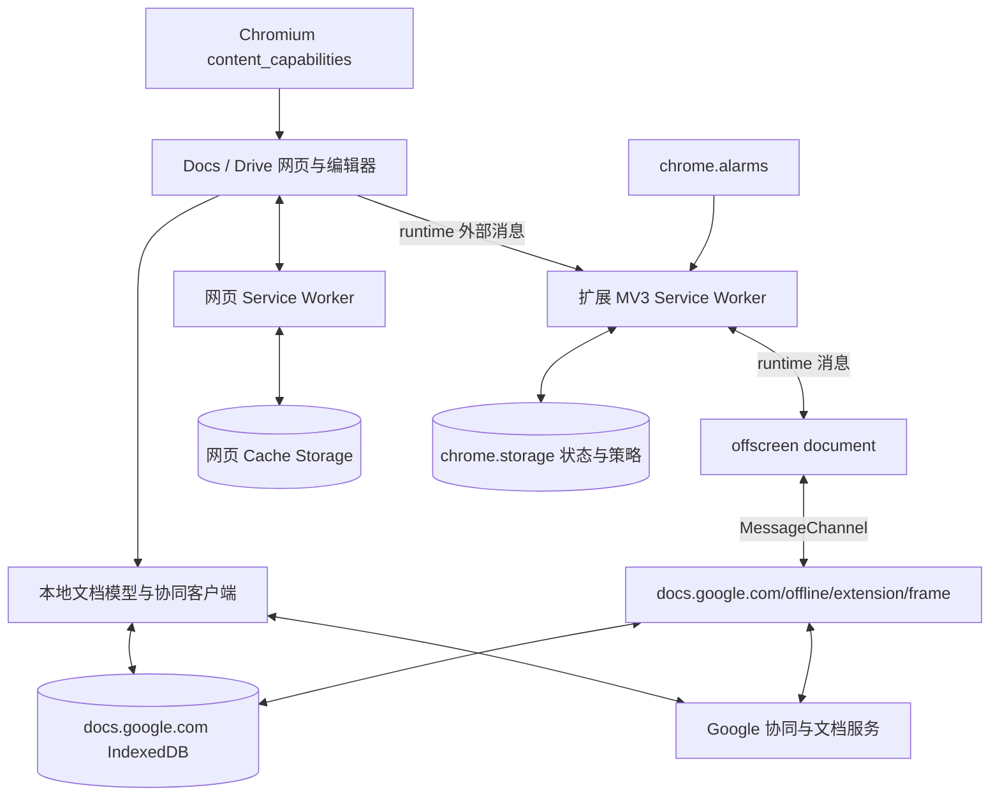
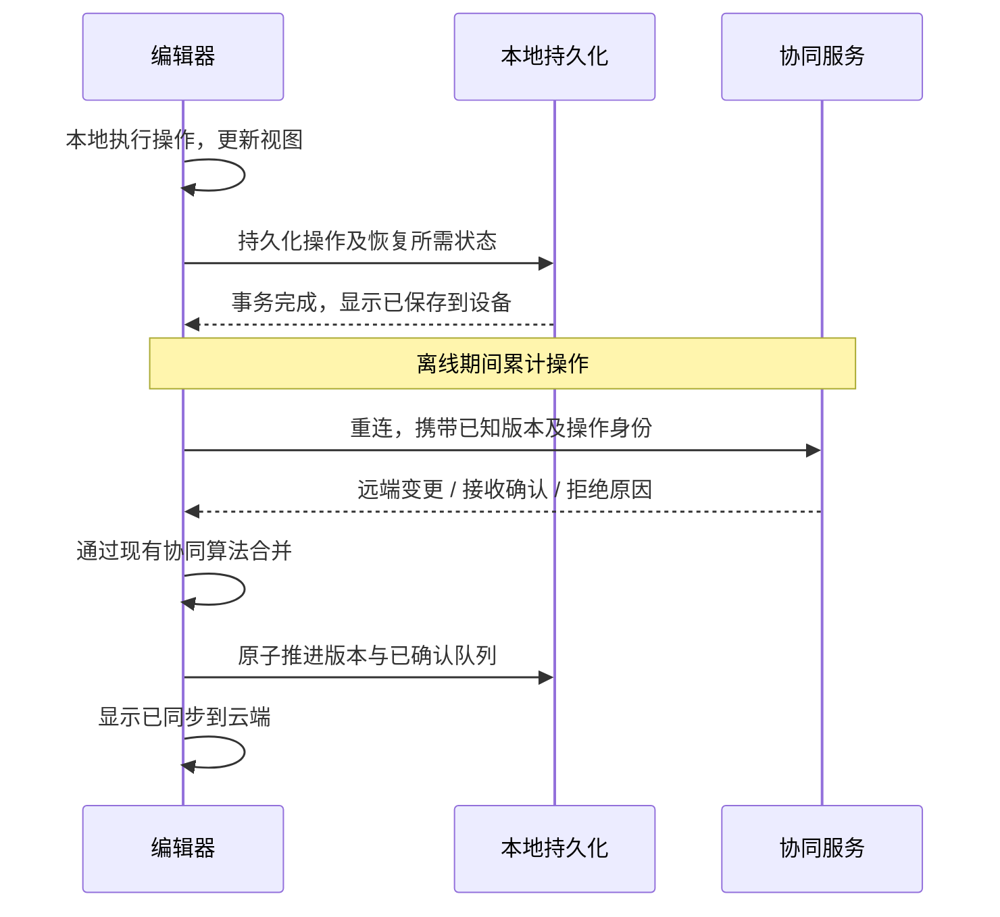

# Google Docs Offline 技术调查与自研文档系统实施建议

工程迁移说明（2026-09-20）：独立 Demo 已并入本仓库 `demo/`，由 pnpm workspace 直接引用共享 `src/`。第 13 节的独立仓库、快照和测试结果仍描述 2026-09-18 历史基线，不代表当前需要复制 upstream。当前安装、两种扩展加载目录及复验命令以 [统一工程指南](WORKSPACE.md) 为准，迁移后结果见 [迁移验证](WORKSPACE-VALIDATION.md)。

研究日期：2026-09-17（Asia/Singapore）

报告修订：2026-09-18，迁移至扩展仓库；补充 Service Worker 边界、真实 Google 测试状态及本地 Demo 验证。

扩展：Google Docs Offline `1.110.1`，ID `ghbmnnjooekpmoecnnnilnnbdlolhkhi`

工程入口：[README](../README.md)；本机样本归档：[original/](../original/)

基线版本：扩展模块化重构 `e052242`；Offline Docs Demo `8486658`。本文后续文档修订不改变这些代码验证基线。

阅读导航：第 3–6 节解释实现；第 7、11 节说明验证边界；第 8 节给出实施建议；第 12 节回答无 Service Worker 的可行性；第 13–14 节连接 Demo 实践与后续验收。

本文件是仓库内的主研究报告。迁移保留原报告的来源、哈希与调查结论，原 Obsidian 文件作为历史副本保留；本文使用“自研文档系统”指代后续产品方案，使用“Offline Docs Demo”指代独立本地实验。

## 1. 核心结论

Google Docs 离线是**网页离线应用、浏览器持久化、协同同步协议和 Chrome 扩展共同组成的系统**。扩展包没有包含完整的 Docs 编辑器，也没有包办文档数据库和冲突合并。

最初调查在三个互相独立的层面找到了证据；后续重构与 Demo 的证据单列于第 7.3、11、13 节：

1. **本机扩展代码**：MV3 service worker 管理启用状态、账号标识、企业策略、alarm；offscreen document 嵌入 Google 同源网页并转发消息。
2. **用户页面实际引用的 Google 官方网页脚本**：包含 `GoogleDocs` IndexedDB、`Documents`、`DocumentCommands`、`PendingQueues`、`PendingQueueCommands`、`DocumentLocks` 等存储结构，以及网页 Service Worker 注册和缓存更新流程。
3. **Chrome 实践**：文档原先显示已准备好离线；DevTools 的网络条件为 Offline，网络探测请求失败；重新加载后仍恢复文档大纲、编辑工具和 Working offline 状态。

自研文档系统可以借鉴“本地模型 + 持久化命令队列 + 同步协议 + 版本化资源缓存”的主体方案。是否增加扩展，取决于是否需要页面关闭后的后台协调和企业部署。**不能把 Google 的特殊网页权限配置当作普通 Chrome 扩展能力。**

### 证据等级与边界

| 标记 | 含义 |
| --- | --- |
| 官方 | Google / Chrome / Chromium 的公开说明或源代码 |
| 代码 | 本机扩展或该页面引用的公开脚本中存在的实现 |
| 实测 | 本次实际观察或执行得到的结果 |
| 推断 | 从证据推导的解释，不代表掌握 Google 全部内部设计 |
| 建议 | 为自研文档系统提出的方案，不是 Google 实现声明 |

Google 调查未读取用户文档正文数据库、Cookie 或登录令牌，没有导出 HAR，也没有修改已有文档正文。后续只在新建的专用文档写入合成测试文字；重构版在真实 Google 服务上仍未完成“离线产生新改动 → 重启 → 与另一用户并发合并 → 服务端确认”的端到端测试。独立本地 Demo 已覆盖的路径另见第 13 节，不能用于替代 Google 产品验收。数据库表名来自实际页面引用脚本的静态分析，不能声称全部表都已在该账号中创建或使用。Google 的服务端协议及当前 OT/CRDT 算法细节仍不可由扩展包完整还原。

## 2. 资料和样本来源

- [Google Drive 离线使用说明](https://support.google.com/drive/answer/2375012?hl=en)：浏览器、预先开启离线、单文件离线、离线预览和恢复联网后的行为。
- [Google Docs Editors 离线使用与排错](https://support.google.com/docs/answer/6388102?hl=en-GB)：每个浏览器 profile 只允许一个账号启用离线，近期文件自动缓存与显式选择文件。
- [扩展商店页面](https://chromewebstore.google.com/detail/google-docs-offline/ghbmnnjooekpmoecnnnilnnbdlolhkhi)：工具抓取未成功；用户已打开页面，版本以本机 manifest 为准。
- [Google 官方扩展更新入口](https://clients2.google.com/service/update2/crx?response=redirect&prodversion=140.0.0.0&acceptformat=crx2,crx3&x=id%3Dghbmnnjooekpmoecnnnilnnbdlolhkhi%26uc)：本次返回 1.110.1 CRX，保存于工程 `research/downloads/`。
- [页面引用的离线 iframe API 脚本](https://docs.google.com/static/offline/client/js/3035349842-docs_offline_iframe_api_bin.js)：在用户 Docs 的 Network 面板中观察到它发起扩展 `page_embed_script.js` 请求，随后从此公开 URL 下载分析。原始文件及格式化副本位于 `research/downloads/`、`research/readable/`。

最初直接访问 Chrome profile 目录被 macOS 拒绝；用户复制到 Projects 后可读。对比发现三个 JS 文件与官方 CRX 内文件逐字节一致；本机 manifest 增加了 `key`，图标等资源存在差别，因此工程以用户复制版本为基准。

| JavaScript 文件 | 原始 SHA-256 |
| --- | --- |
| `service_worker_bin_prod.js` | `3d98261dc84b114d5b0f29f2c47fc08ae9ba13b177f100d740e413d5716f5c1e` |
| `offscreendocument_main.js` | `cabb475f35b9ee52751af070a2307ec4373b068ffbe2e84958e157cb24b421ba` |
| `page_embed_script.js` | `44ffccd887253071f2d25b8cacc86131f40cd31434228caa225b67cea7bb9883` |

## 3. 整体架构与职责划分



图中的 frame 与 Docs 网站同源、与扩展页面跨源；扩展创建说明和 URL 支持其访问网站数据的设计意图。它具体执行哪些同步任务仍需要 frame 自身代码与网络轨迹确认。网页 Service Worker 与扩展 Service Worker 是**两个独立运行环境**：前者控制同源网页请求，后者接收扩展事件。不能用 manifest 的 `background.service_worker` 解释 Docs 页面导航缓存。

### 3.1 扩展包含什么

| 文件 | 代码证据与作用 |
| --- | --- |
| `manifest.json` | MV3、后台脚本、允许 Google 网页连接、域名权限、企业配置、资源声明 |
| `page_embed_script.js` | 写入 `_docs_chrome_extension_exists`、功能版本 2、权限列表、manifest 版本和扩展版本；是能力探测标记 |
| `service_worker_bin_prod.js` | 状态持久化、消息分发、offscreen 生命周期、heartbeat、错误报告 |
| `offscreendocument.html` | 加载一个外部 JS 文件的静态 HTML |
| `offscreendocument_main.js` | 创建 iframe、握手、MessageChannel RPC、连接计数及关闭计时 |
| `dasherSettingSchema.json` | 可允许离线及可自动启用离线的企业域名列表 |
| `_locales/`、`128.png` | 文案与图标 |

manifest 没有 `content_scripts`，`page_embed_script.js` 通过 `web_accessible_resources` 暴露。实测由 Docs 的离线 iframe API 脚本加载；因此不能称为“扩展自动向所有页面注入内容脚本”。声明中的 `<all_urls>` 是资源可访问范围，不等于扩展有权读取所有网页。

### 3.2 最重要的特殊能力：content_capabilities

manifest 将 `clipboardRead`、`clipboardWrite`、`unlimitedStorage` 赋予匹配的 Google 网页。普通顶层 `permissions: ["unlimitedStorage"]` 则针对扩展自己的存储，二者不是同一范围。

Chromium 的 [manifest feature 定义](https://chromium.googlesource.com/chromium/src/+/refs/heads/main/extensions/common/api/_manifest_features.json) 对 stable 的 `content_capabilities` 设置了扩展 ID hash allowlist；源码另有 canary 分支，不能据此推断生产 Chrome 可无条件使用。对应的 [浏览器测试](https://chromium.googlesource.com/chromium/src/+/refs/tags/140.0.7267.1/chrome/browser/extensions/content_capabilities_browsertest.cc) 验证网页能力按域名匹配。

对自研文档系统的直接影响：不能复制这一 manifest 字段，就获得业务网页无限存储。网页应使用标准持久化与配额管理；扩展若用自己的 origin 存储，则需明确消息协议和数据所有权。[Chrome 扩展存储说明](https://developer.chrome.com/docs/extensions/develop/concepts/storage-and-cookies?authuser=0) 还说明了扩展 iframe 与 host permission 下的 storage partitioning 例外，这帮助解释 Google 为何在 offscreen 页面里放 Google iframe；Cookie 行为仍需单独验证。

## 4. 扩展实际运行流程

以下短符号按文件分别解释；同名符号在两个 bundle 中不是同一个实现。可在 `research/readable/` 搜索函数名定位。

### 4.1 启动与恢复

`service_worker_bin_prod.js` 尾部执行 `self.window = self; new dn().load()`。

- `dn` 构造时同步注册 `alarms.onAlarm`、`runtime.onMessageExternal`、`runtime.onMessage`、`runtime.onConnectExternal` 等事件。
- `load()` 保存 `docsDomain = "docs.google.com"`，初始化错误报告及 offscreen 管理器。
- `pb()` 读取 `offlineOptedIn`，区分 `unknown`、`opted_in`、`opted_out`；已启用时读取 `optedInUserOuid` 并重新建立 frame。
- `chrome.storage.local` 还记录 `lastSuccessfulFrameConnectTime`。这里看到的是少量控制状态，不是文档正文数据库。

Chrome 可终止空闲扩展 worker，因此持久化状态和可重建连接是必要设计。[扩展 Service Worker 生命周期](https://developer.chrome.com/docs/extensions/develop/concepts/service-workers/lifecycle) 说明了事件唤醒与终止条件。扩展页显示 “Inactive” 本身不代表故障。

### 4.2 offscreen + 同源 iframe

设计动机可先读 [Offscreen 案例讲解](OFFSCREEN.md)：以“断网修改后关闭文档，后续在后台上传”为例，解释为什么需要隐藏 DOM、为什么还要网站 iframe，以及数据归属、存储分区和生命周期边界。该案例对应本地 Demo，不将其 Yjs/ACK 实现当作 Google 私有协议。

`Dm` 生成 `offscreendocument.html?randomPercentageForSampling=...&sessionId=...`；`Pm` 调用 `chrome.offscreen.createDocument`，reason 为 `IFRAME_SCRIPTING`。创建说明直接写明用途是通过 iframe 访问 docs.google.com 域的数据。

offscreen bundle 中 `tm()` 创建 `id="extensionFrame"` 的 iframe，地址为：

```text
https://docs.google.com/offline/extension/frame?ouid=<encoded user identifier>
```

`vm()` 用 `MessageChannel` 建立一次请求对应的回复端口，结束时关闭端口；`Lm()` 处理 frame 握手及用户状态回传。消息对象来自数组形式的序列化消息结构，数字字段不应贸然替换成自行设计的 JSON 字段。

[Offscreen API 文档](https://developer.chrome.com/docs/extensions/reference/api/offscreen) 说明它提供隐藏 DOM 页面，通常只能使用 `chrome.runtime` 这个扩展 API，其他 API 应通过 worker 代理。本机包声明最低 Chrome 88，但 `offscreen` 公共 API 从 Chrome 109 提供；该 manifest 值不能作为所有运行路径在 Chrome 88 都可用的保证。

### 4.3 后台调度不是常驻进程

| 行为 | 本版本代码 |
| --- | --- |
| Heartbeat | `kn()` 建立名为 `heartbeat`、周期 5 分钟的 alarm，转发给 frame |
| 启动延迟 alarm | `Ab()` 创建名为 `open`、延迟 1 分钟的 alarm；函数由 25,200,000 ms 定时器调度，不应解读为可靠常驻计时 |
| iframe 握手超时 | 14 秒后进入失败路径，随后还等待额外 14 秒及日志排空，再关闭页面；不是第 14 秒直接关闭 |
| 无外部连接 | offscreen 连接数为 0 时设置 60 秒关闭计时；处理中会延后 |
| offscreen 上限 | 自启动起 1 小时强制关闭 |
| 通道中断恢复 | 接收端不存在、端口提前关闭等错误触发 offscreen 重建或一次延迟 2 秒的重试路径 |
| 退出离线 | 写入 false，移除 OUID，清除 heartbeat，关闭 offscreen |
| 账号不匹配 | `pn()` 尝试重建 frame，并设标志防止无限恢复 |

上述是代码配置，不是精确实时调度保证。系统休眠、进程被终止、浏览器退出均会改变实际时机。

### 4.4 消息分发速查

根据 worker `wb()` 及 offscreen `Mm()` 的分支推导语义；名称是研究命名，原始枚举名不可恢复。

| 通道 | type | 分支用途 |
| --- | --- | --- |
| 网页 → worker | 1 | frame 已连接，保存账号/连接时间，解除就绪等待 |
| 网页 → worker | 2 | 启用/确保离线 frame，启动 heartbeat |
| 网页 → worker | 3 | 用户退出或账号不匹配 |
| 网页 → worker | 4 | 向离线 frame 转发业务请求 |
| 网页 → worker | 5 | 查询企业域名允许/自动启用策略 |
| worker → offscreen | 1 | 初始化并重建 iframe |
| worker → offscreen | 4 | 转发请求至已连接的 frame |
| worker → offscreen | 5 | 移除 iframe |
| worker → offscreen | 6 | 初始化并确保 iframe 存在 |
| offscreen → worker | 3 | 汇报连接账号和时间 |
| offscreen → worker | 7 | 汇报用户状态变化 |

不能把不同通道的同一数字当作同一枚举。自研文档系统实现应明确版本、通道、requestId、错误类型、sender 校验以及请求超时。

## 5. 网页侧的数据和缓存：代码级证据

以下来自 `3035349842-docs_offline_iframe_api_bin.js`，而非扩展内 JS。其功能受运行时 feature flags 影响，静态存在不等于所有用户都启用。

### 5.1 IndexedDB 不是缓存一段 HTML

脚本直接调用 `indexedDB.open("GoogleDocs")`。schema 初始化代码包括：

| Store / 字段 | 代码所支持的解释 |
| --- | --- |
| `Documents`，keyPath `id` | 文档元数据与状态；包含 rev、快照版本、最近同步时间等字段 |
| `DocumentCommands`，`dcKey` | 文档命令记录 |
| `DocumentCommandsStaging` | 分阶段写入的命令区域；具体切换协议需进一步追踪 |
| `DocumentCommandsMetadata` 及 Staging | 命令元数据 |
| `PendingQueues`，`docId` | 按文档维护的待处理队列 |
| `PendingQueueCommands`，`pqcKey` | 尚待处理/同步的命令记录 |
| `DocumentLocks`，`dlKey` | 文档写入协调，含 session、过期时间 |
| `Comments` 及 `StateIndex` | 评论状态，也参与待同步内容检查 |
| `DocumentEntities`、`FileEntities` | 文档关联实体 |
| `SyncObjects`、`ApplicationMetadata`、`Users` | 同步对象、应用及账号相关元数据 |
| `FontMetadata`、`BlobMetadata` | 字体、二进制资源元数据；不据表名断言资源正文都存于此 |
| `NewDocumentIds`、`pendingCreation` | 离线创建文档的准备和状态线索 |

看到的字段包括 `lastServerSnapshotTimestamp`、`snapshotState`、`snapshotProtocolNumber`、`snapshotVersionNumber`、`pendingQueueState`、`modelNeedsResync`。这些支持“快照/命令/待同步状态分离”的判断，但没有给出完整服务端 wire protocol。

### 5.2 防止缓存清理误删未上传改动

`$z()` 删除文档前调用 `aA()` / `bA()` 检查待同步命令和评论；普通路径遇到未处理内容会中止事务，错误为 `Pending changes found`。另有显式强制路径，因此不能说任何情况下都绝不删除。

这个细节对自研文档系统比缓存算法名称更重要：可重新下载的快照与尚未被服务端确认的本地改动，必须具有不同的清理规则。

### 5.3 多标签页与锁

代码同时包含 `DocumentLocks`、session 所有者校验、过期时间、`navigator.locks` 分支及 localStorage 锁释放标记 `dcl_...`；还出现 `BroadcastChannel` / `SharedWorker` 能力检查。

这不是服务器多人编辑冲突解决，而是同一浏览器多个执行上下文对本地数据的协调。自研文档系统需要分别设计“同设备多标签页写入”和“跨设备远端合并”，不能用一个内存布尔值覆盖两类问题。

### 5.4 网页 Service Worker 与缓存更新

脚本中可定位：

- 应用级路径，例如 `/document/offline/serviceworker.js?ouid=...`，从应用 URL 配置动态构造。
- 公共 `/offline/common/serviceworker.js`，scope `/offline/`。
- 根 `/offline/root/serviceworker.js`，scope `/`。
- Drive / ODP 相关 worker 更新配置与 feature flags。
- `navigator.serviceWorker.register`、`updatefound`、`statechange`、安装/激活等待、与 worker 的消息交互。
- `fG` 持有 `I.caches`；退出清理路径会遍历 Cache Storage。没有取得 worker 完整源码，不能直接断言每个 URL 的 cache-first/network-first 规则。

代码有 `install-and-message`、`only-via-install`、`no-cache-update` 三种更新策略，说明资源准备与 worker 注册并非一个布尔开关。[标准 Worker 生命周期说明](https://web.dev/articles/service-worker-lifecycle) 可用于理解安装、等待、激活及版本混用风险。

离线启动所需至少包含编辑器代码、文档本地数据及必要资源。缓存应用壳不自动保证所有图片、字体、嵌入对象可离线使用；就绪状态应按资源需求决定。

## 6. 离线编辑与重连合并原理

Google 在 2010 年官方文章中明确介绍过 OT 和协同协议：客户端记录服务端 revision、本地未发出操作、已发出未确认操作和可见文档状态；服务器维护操作历史并转换并发操作。[Making collaboration fast](https://drive.googleblog.com/2010/09/whats-different-about-new-google-docs.html)

这是**历史官方证据**，不是对 2026 年所有 Google 编辑器内部算法的完整证明。本次的 pending queue、revision 和 snapshot 字段与操作式同步设计一致；仍不能凭这些字段确认现代实现的所有转换规则，或宣称 Google 使用 Yjs。

对原理可采用如下抽象理解：



时序图是可实施的抽象方案，不是已抓取的 Google 协议时序。特别要区别“内存中看见文字”“存到本机”“服务端已确认”三种状态。

不要把帮助中心对新旧修改的简化描述解释成“最后一个整篇 JSON 覆盖其它用户”。复杂协同文档需要保留并发语义；不能拿页面说明代替合并算法证据。

## 7. 本次实践结果与复现步骤

### 7.1 已执行

| 检查 | 实际结果 | 能证明什么 |
| --- | --- | --- |
| 本机扩展读取 | 用户复制目录可读，版本 1.110.1 | 样本来源可靠 |
| 官方 CRX 交叉校验 | 三个 JS 的 SHA-256 一致 | 下载样本与本机可执行 JS 一致 |
| 文档状态弹层 | 显示文档已准备好离线，重连后保存到 Drive | 该文件已完成产品层离线准备 |
| DevTools Network | 原已有 Offline、Disable cache；netcheck.gif 报 ERR_INTERNET_DISCONNECTED | 页面网络处于模拟断网条件 |
| 扩展资源 | `page_embed_script.js` 200，发起者为离线 iframe API 脚本 | 网页能力探测链路实际发生 |
| 普通重新加载 | 加载阶段 Trying to connect，随后 Working offline；大纲与 Editing 恢复 | 离线重新加载可启动，不仅是旧页面留在内存 |
| 网页脚本分析 | 确认 IDB schema、pending queues、文档锁、SW 更新逻辑 | 网页承担离线数据层的代码证据 |

DevTools 的 Application 详情未稳定暴露到自动化可读界面，因此不报告该 profile 的数据库记录数量、实际缓存键或注册 worker 清单。上表记录的是最初原版扩展环境下的观察，未改动当时已有的 Offline / Disable cache 选择，不能将其归为重构版测试结果。后续正常 Chrome 的扩展开关状态见第 7.3 节。

### 7.2 下一轮完整验证矩阵

使用专门测试文档和另一个隔离 profile，先确认全部已同步，再执行以下实验。保留未上传改动时不要用清空站点数据作为排错第一步。

| 场景 | 操作 | 验收 |
| --- | --- | --- |
| 真正断网冷启动 | 在实验环境阻断所有相关目标网络，关闭标签再打开文档 | app shell、模型、核心资源均可恢复 |
| 本地持久化 | 离线添加唯一标记，等待“保存到设备”，刷新并重启浏览器 | 改动仍在 |
| 重连 | 恢复网络，等待保存到云，再用独立客户端读取 | 服务端有且仅有一份改动 |
| 并发冲突 | A 离线编辑，B 在线编辑相邻或重叠区域，A 重连 | 所有客户端收敛，符合产品冲突规则 |
| ACK 丢失 | 服务端接收后切断回复，客户端重试 | 操作不重复 |
| 多标签页 | 同设备两个标签编辑，关闭持锁标签 | 无双写破坏，锁能恢复 |
| worker 终止 | 关闭 offscreen / 终止 worker 后触发新任务 | 能从持久化状态恢复 |
| 账号与权限 | 离线后切账号，或远端撤销写权限再联网 | 不串账号，保留草稿并显示不可同步原因 |
| 版本升级 | 缓存旧版本离线数天，发布新 schema 后重连 | 可迁移，旧标签兼容，不丢队列 |
| 存储不足 | 用测试环境配额故障注入 | 不虚报已保存，pending 不被 LRU 删除 |
| 大文件/附件 | 离线打开大文档和含图文档 | 缺失资源有明确状态和回退 |

DevTools 单页 Offline 不代表扩展 worker、offscreen iframe 和另一标签全部断网。要验证完全离线，应在隔离环境阻断所有相关网络；切系统网络会影响其它工作，应安排单独实验。

### 7.3 验证证据分层：不要混淆不同环境

截至 2026-09-18，已有结果如下。这里汇总的是保存下来的运行记录；本次文档迁移没有重新运行 Google 或 Demo 测试。

| 环境 | 已确认 | 尚不能得出的结论 | 可核查记录 |
| --- | --- | --- | --- |
| 原版扩展 + 用户 Google 页面 | 离线就绪，模拟断网后普通重载恢复编辑界面 | 重构版正确、离线新改动上传成功 | 本节 7.1 的观察记录 |
| 原版 / 重构版 + 合成 Docs 页面 | 22 项差分测试通过；真实 Chromium 原生扩展链路回归一致 | 已连接 Google 同步后端、覆盖所有执行路径 | [验证说明](../research/validation/RESULTS.md)、[浏览器结果](../research/validation/browser-smoke.json) |
| 重构版 + 隔离 Google 登录页 | 三个实际加载 JS 的哈希与重构产物一致 | 已登录、已离线编辑或同步 | [会话历史快照](../research/validation/google-docs-live.json) |
| 正常 Chrome + 专用 Google 测试文档 | 原版开关 Off；新建文档在线基线已保存；Docs 提示扩展缺失或未激活 | 重构版已启用或已运行失败 | [正常 Chrome 记录](../research/validation/normal-chrome-live.md) |
| 派生扩展 + Offline Docs Demo | 本地服务下 5 项来源/单元检查及 8 条真实浏览器集成路径通过 | Google 私有协议等价、生产系统已就绪 | 第 13 节的固定版本报告 |

隔离 Google 会话在停留登录页后已关闭，随后按用户要求切换正常 Chrome。正常 Chrome 的后续步骤须先确认加载来源、启用状态和实际运行文件，再执行离线编辑、刷新、重连和独立客户端读取。不要把旧 profile 中原先存在的站点缓存误当成“重构扩展完成了首次离线准备”。

## 8. 自研文档系统建议方案

### 8.1 推荐先做网页主体

建议起点为：**网页 Service Worker + IndexedDB + 已有协同引擎的持久化操作队列**。浏览器扩展作为可选后台增强。现有产品的协同模型未提供，不能直接决定把它换成 CRDT。

| 模块 | 推荐职责 |
| --- | --- |
| Offline bootstrap | 离线可加载的路由、HTML、编辑器和必要资源；账号识别不能必须依赖在线请求 |
| Local document store | 按 tenantId、userId、docId 隔离快照、操作、元数据与附件引用 |
| Durable outbox | 稳定 opId、clientId、clientSeq、baseRevision、schemaVersion、payload；崩溃后可恢复 |
| Sync coordinator | 补拉、上传、ACK、重试、退避、鉴权恢复、权限变化 |
| Collaboration adapter | 接入已有 OT / CRDT / 服务端合并机制 |
| Local concurrency | Web Locks / 持久化租约协调，BroadcastChannel 通知；正确性仍靠事务与幂等 |
| Availability manager | pin、近期文件预取、容量预算、依赖完整性、不可用原因 |
| Optional extension | 企业策略、alarm 唤醒、跨标签协调；避免重复实现另一份正文存储 |

如果当前使用 OT，要先确认服务端对旧 base revision 的变换窗口、历史保留与过旧操作处理；如果使用 CRDT，也要验证删除、权限、schema、更新去重、压缩与恢复。选择 Yjs 的新项目可参考 [Yjs 官方离线持久化说明](https://docs.yjs.dev/getting-started/allowing-offline-editing)，其中 IndexedDB provider 保存本地更新，Service Worker 另行缓存网页资源。该库不是 Google 实现证据。

### 8.2 必须成立的数据不变量

1. 只有本地事务提交成功后，才展示“已保存到此设备”。UI 可以先乐观更新，但应保留“正在保存”状态。
2. 不能在缺少服务端明确确认时丢弃 outbox 操作；处理“服务端已接收、客户端未收到 ACK”这一重试窗口。
3. ACK 游标、快照/本地基线和队列移除必须按既定协议原子更新或具备恢复记录。
4. 先稳定生成 opId，重试必须复用。服务端去重不能仅依赖短暂内存。
5. pin 的可下载缓存与 pending 的不可丢本地改动分开管理；允许清理前者，不可误清后者。
6. 账号/租户身份参与所有 key、路由与读取检查；注销后不能从旧缓存错误展示上一账号数据。
7. 远端拒绝写入时保存本地分支，提供复制/导出/重新授权路径；不能为了回到“同步成功”而丢弃数据。

建议模型草图（不是照搬 Google schema）：

```text
documents [tenantId, userId, docId]
  snapshot, serverRevision, snapshotSchemaVersion, updatedAt
outbox [tenantId, userId, docId, clientId, clientSeq]
  opId, baseRevision, operationSchemaVersion, payload, status
syncState [tenantId, userId, docId]
  ackCursor, remoteCursor, leaseEpoch, lastError
availability [tenantId, userId, docId]
  pinned, metadataReady, modelReady, requiredAssetsReady, appVersion
assets [tenantId, userId, assetId]
  contentHash, bytes/reference, downloadState, lastUsedAt
```

### 8.3 资源更新与存储

应用代码按构建版本缓存，内容哈希标识静态资源。持久化文档数据按 schema 版本迁移。不要在一个新 worker 激活时无差别删除旧资源，仍打开的旧编辑器可能需要它们。Service Worker 仅负责路由和缓存不够：离线 bootstrap 不得卡在登录态刷新、远端配置或 CDN 字体请求上。

在用户开启离线时申请 `navigator.storage.persist()`，检查结果；用 `estimate()` 做容量预算和预取阈值。持久化降低自动驱逐风险，不承诺无限容量，也不能抵抗用户手动删除。[Persistent storage](https://web.dev/articles/persistent-storage)

### 8.4 同步状态与用户体验

把连接状态、保存状态、离线可用性设计为三个维度。可以“当前在线但尚未缓存完整”，也可以“离线且修改已存本机”。

建议文案包括：准备离线、可离线使用、正在保存到设备、已保存到设备待同步、正在同步、已保存到云端、需重新登录、权限已变化、存储空间不足。不要只显示一个绿色勾。

### 8.5 分阶段实施与验收

| 阶段 | 交付目标 | 退出条件 |
| --- | --- | --- |
| P0 协议审计 | 梳理现有操作模型、ACK、幂等、历史窗口、账号与路由 | 明确长离线后的合并与失败恢复规则 |
| P1 离线打开 | app shell、手动 pin、本地快照、状态 UI | 断网后可重新打开指定文档 |
| P2 离线编辑 | outbox、事务、重启恢复、重连同步 | 刷新/重启不丢修改，重试不重复 |
| P3 协同与故障 | 多标签锁、并发合并、权限拒绝、版本迁移、配额注入 | 故障矩阵收敛且 pending 数据可恢复 |
| P4 自动缓存与后台 | 近期预取、容量策略、可选企业扩展 | 页面关闭后的能力边界明确且可观测 |

优先记录本地事务失败率、未 ACK 操作年龄、重连至同步完成耗时、缓存准备失败原因、恢复成功率和 schema 迁移失败。指标只记录必要元数据，避免携带文档正文。

## 9. 扩展工程还原范围与一致性标准

研究报告主体完成后，先完成了格式化和注释版。根据用户反馈，该版本不满足“能给人看的代码逻辑”，现已进一步完成实际业务模块化重构。阅读和修改入口为 `src/`，`extension/` 是它的真实构建产物。具体结果见第 11 节。

由于没有 Google 原始 source map 和原工程，无法恢复开发者原始变量名、TypeScript 或构建历史。当前模块和语义命名由实际控制流重建：后台分为状态、企业策略、heartbeat、offscreen 管理及控制器；隐藏页分为 iframe 管理、生命周期、消息路由及控制器。通用 Closure/数组协议/遥测/安全 URL 库隔离在 `src/vendor/`，通过两个 `runtime-api.js` 使用。新生成的 source map 指向本项目重构源码，不是 Google 原始源码。

一致性分三层：

- **来源与构建完整性**：原始样本哈希不变；85 个非 JS 资源字节相同；vendor 提取区间和 token 可追溯；三个入口可确定性构建且 source map 与源码匹配。重构业务不再宣称与原版 AST/token 一致。
- **可执行行为回归**：原始与可读版本在相同模拟 Chrome API 下运行，比较消息响应、storage 写入、alarm、iframe URL 和关键失败分支。
- **真实 Google 端到端等价**：需要相同 ID、浏览器版本、账号、策略和服务端环境，并完成离线编辑/重连测试。前两层通过不能冒充第三层已经完成。

本机 manifest 的 `key` 是扩展公钥，不是私钥。保留它可保持 unpacked 扩展 ID；不能因此宣称获得 Google 的签名或发布资格。同一 profile 不应同时替换/运行相同 ID 的两个版本。实际安装验证优先使用隔离 profile；调查工具没有覆盖用户已安装扩展及其存储。用户后来选择在正常 Chrome 手动禁用原版并加载重构版，该轮验证尚未达到重构版启用的前提，见第 7.3 节。

还原只覆盖 extension 包，网页 iframe、网页 Service Worker、Docs 编辑器和 Google 后端均不在包中。把还原扩展加载到 Chrome，不会得到一个独立可运行的 Google Docs 或自研文档系统离线编辑器。

## 10. 参考资料索引

1. [Drive 离线帮助](https://support.google.com/drive/answer/2375012?hl=en)
2. [Docs Editors 离线帮助](https://support.google.com/docs/answer/6388102?hl=en-GB)
3. [Google 协同协议历史官方说明](https://drive.googleblog.com/2010/09/whats-different-about-new-google-docs.html)
4. [Google 文档保存状态 UI 说明](https://workspaceupdates.googleblog.com/2020/06/new-save-status-online-offline-google-docs.html)
5. [Chromium content_capabilities 白名单](https://chromium.googlesource.com/chromium/src/+/refs/heads/main/extensions/common/api/_manifest_features.json)
6. [Chromium content_capabilities 浏览器测试](https://chromium.googlesource.com/chromium/src/+/refs/tags/140.0.7267.1/chrome/browser/extensions/content_capabilities_browsertest.cc)
7. [Chrome 扩展 storage / partitioning](https://developer.chrome.com/docs/extensions/develop/concepts/storage-and-cookies?authuser=0)
8. [Chrome offscreen API](https://developer.chrome.com/docs/extensions/reference/api/offscreen)
9. [扩展 worker 生命周期](https://developer.chrome.com/docs/extensions/develop/concepts/service-workers/lifecycle)
10. [网页 worker 生命周期](https://web.dev/articles/service-worker-lifecycle)
11. [网页持久化存储](https://web.dev/articles/persistent-storage)
12. [Yjs 离线持久化](https://docs.yjs.dev/getting-started/allowing-offline-editing)
13. [本次页面引用的 Google 离线脚本](https://docs.google.com/static/offline/client/js/3035349842-docs_offline_iframe_api_bin.js)

上述线上路径和 main 分支会变化；复核时应结合本地保存样本与 SHA-256，避免将未来版本的行为混入本次结论。

## 11. 工程还原交付与最终验证

第一版格式化完成于 2026-09-17；当前模块化重构与重新验证完成于 2026-09-18（Asia/Singapore）。

- [工程说明](../README.md)
- [可直接加载的 manifest](../extension/manifest.json)
- [关键代码导航](CODE_MAP.md)
- [消息协议说明](PROTOCOL.md)
- [实践指南](PRACTICE.md)
- [验证结果及边界](../research/validation/RESULTS.md)
- [原生浏览器验证记录](../research/validation/browser-smoke.json)

源码目录为 `src/`，Chrome 加载目录为 `extension/`，其中包含 3 个实际模块构建出的 JS、3 个新 source map 及 85 个原始非 JS 资源。`original/` 为用户样本的只读约定基线。仅排除 Finder `.DS_Store` 和商店安装校验 `_metadata/`；用户源目录未修改。

建议从 [ExtensionController](../src/background/extension-controller.js)、[OffscreenManager](../src/background/offscreen-manager.js)、[GoogleIframeManager](../src/offscreen/iframe-manager.js) 开始阅读。`frameReady`、`frameConnected`、`accountRecoveryAttempted`、`activeConnections` 等现在是实际源码状态名，不只是附在压缩符号旁的注释。

### 验证结果

| 检查 | 最终结果 |
| --- | --- |
| 原始样本与运行库来源 | 88 个原始资源 SHA-256 不变；vendor 原始区间及可执行 token 验证通过 |
| 模块构建 | 3 个业务入口确定性构建；bundle 可解析；source map 内容与当前源码相符 |
| 非 JS 资源 | 85 个文件逐字节一致 |
| ID | 公钥派生 ID 与原扩展相同 |
| 差分行为测试 | 22 / 22 通过，新增握手、账号恢复、配置单次初始化、heartbeat force、通道失败重试和错误 envelope 等分支 |
| 原生浏览器测试 | Chrome for Testing 153.0.8010.12 中，原始/可读版分别通过 worker 启动、外部消息、网页探测、offscreen 创建、heartbeat、退出清理，结果一致 |

真实浏览器测试使用两个新 profile 和合成页面/账号，Google 外部请求通过不可用代理阻断。它使用真实 Chrome 扩展 API，既不是纯 mock 测试，也不是用户 Google 服务端同步测试。这一轮隔离回归没有操作用户正式 profile；后来用户正常 Chrome 中原版已关闭的记录属于另一轮测试，不能混为一谈。

当前用 esbuild 将可读 ES modules 编译为经典 IIFE，保持原 manifest 入口。业务命名、作用域和表达方式已改变，不能继续援引第一版的 AST/token 全文件一致结论。旧注释规则和静态证明保留于 `research/history/formatting-v1/`；当前证明在 `research/validation/modular-build.json`。函数名、错误堆栈、`toString()` 及性能不承诺相同；差分与浏览器测试也不是所有路径的形式化等价证明。

额外核对：ID 字符串 SHA-1 为 `4895B1DBB92D52488F8D9FFDF9CC7B95C7258C9A`，与下载的 Chromium stable allowlist 条目匹配。这是 Google 扩展的能力来源证据，不是自研文档系统可以沿用 Google ID 的产品方案。

复验命令：

```sh
# 在本扩展仓库根目录执行
pnpm install --frozen-lockfile
pnpm check
pnpm exec playwright install chromium
pnpm test:browser
```

后续修改业务请编辑 `src/` 并新增原版对照用例，再运行以上检查；不要直接编辑会被构建覆盖的 `extension/`。涉及协议、安全策略或重试规则的产品化变更，应明确作为独立派生设计，不混入行为保持重构。

## 12. 没有 Service Worker，这套方案还能成立吗？

**本地编辑与持久化可以成立，但不能原样保留全部能力。** 要先区分“没有网页 Service Worker”和“没有扩展 Service Worker”。以下是根据职责边界给出的设计分析，不是本次对 Google 产品进行逐项禁用后的实测结果。

补充研究（2026-09-22）：若要求保留原 HTTPS URL，可进一步研究 HTTP 缓存、debugger/CDP 响应回放、本机 HTTPS 代理或客户端请求处理层，见 [无网页 SW 的离线方案](OFFLINE-WITHOUT-SERVICE-WORKER.md)。其中详细说明 MV2/MV3 普通网络 API 与 CDP 的区别，以及“首次在线录制、后续离线回放”的设计和待验收边界；尚未实施。

### 12.1 三个执行环境不能互相替代

| 环境 | 主要职责 | 没有它会怎样 |
| --- | --- | --- |
| 网页 Service Worker | 在受控范围内处理导航与资源请求，从缓存启动应用 | 当前已打开页面仍可编辑和写 IDB，但断网后的重新打开缺少可控的网页引导入口 |
| 扩展 MV3 Service Worker | 接收外部消息和 alarm，恢复状态，管理 offscreen | 本版本扩展的后台控制链路断开；网页本身仍可另行实现离线与前台同步 |
| offscreen 内的网站 iframe | 运行网站 origin 的脚本，访问其数据并承担网站侧任务 | 原扩展缺少网站数据执行上下文；扩展 worker 自己的 IDB 不会自动变成网站数据库 |

网页 worker 的离线价值来自请求拦截和缓存响应，并非“让 JavaScript 永远在后台运行”。参见 [Service Worker API](https://developer.mozilla.org/en-US/docs/Web/API/Service_Worker_API)。offscreen 提供 DOM 环境；原实现选择嵌入网站 iframe，并不意味着 offscreen 可以代替网页导航缓存。

### 12.2 只去掉网页 Service Worker 的能力矩阵

假设编辑器已加载、页面脚本实现了本地读写与协同协议，且保留扩展 worker：

| 需求 | 是否可行 | 必须满足的条件或限制 |
| --- | --- | --- |
| 当前页面断网继续输入 | 可以 | 所需代码与资源已经加载，编辑路径不依赖在线请求 |
| 修改持久化到设备 | 可以 | 页面直接使用 IndexedDB，保存状态以事务完成为准 |
| 当前页面重连后上传 | 可以 | 有可运行的同步执行者及可重试协议，SW 不是合并算法 |
| 断网刷新或重新打开网站 | 不能作稳定保证 | HTTP 缓存可能命中，但应用无法据此保证入口、路由和全部资源可用 |
| 已存在的隐藏 iframe 同步 | 有条件可以 | iframe 仍活着且代码已加载；不存在永久存活保证 |
| 隐藏页被销毁后离线重建 | 不能作稳定保证 | 扩展 HTML 在包内，但网站 iframe 的 HTML/JS 仍须能够加载 |
| 浏览器完全退出后同步 | 不可以 | 本方案没有浏览器之外的常驻进程 |

因此，**“IDB 中还有文档”不等于“断网时有程序能把文档打开”**。普通 HTTP 缓存、Cache Storage、IndexedDB 分别解决响应缓存、应用显式维护的请求/响应数据、结构化文档与操作记录；它们不是同一个层次。即使页面提前把 HTML 放进 Cache Storage，也仍需能够启动的代码或请求处理入口来读取它。

若明确不能使用网页 Service Worker，可以将完整编辑器和启动资源打包为扩展页面或桌面容器，并重新设计数据 origin、认证和消息桥接。这是另一种可行架构，但改变了应用入口与部署方式，**不是删除 Google 方案里的一个文件就获得等价效果**。把 Google iframe URL 留在原位置、只禁用网页 SW，不构成这样的替代方案。

### 12.3 扩展是否为离线编辑的必要条件？

对自研文档系统，不必然需要：网页 SW + IndexedDB + 前台同步客户端即可构成离线编辑主体，代价是页面关闭后的执行机会不同。

对本仓库还原的 MV3 扩展，其 background worker 是必需控制器，不能直接移除。对当前 Offline Docs Demo，上传被刻意限制在扩展持有的 iframe 中，**没有扩展时可保留本地编辑，但不会自动切换为前台上传**；这使实验能够验证原扩展链路确实参与工作，而不是被旁路。

是否需要扩展，应由“页面关闭后的任务机会、企业管理、部署成本”决定，不应由“是否需要 IndexedDB”决定。Chrome 的终止、休眠与 alarm 调度仍须按可恢复任务处理，不能承诺关页后实时或无限后台同步。

## 13. Offline Docs Demo：从研究到可运行实践

### 13.1 可复核的工程边界

[Demo 仓库固定版本 `8486658`](https://github.com/coffeedeveloper/google-docs-offline-demo/tree/8486658) 包含文件列表页、纯文本编辑页、离线可用状态、诊断面板和本地服务。它使用本扩展仓库 `e052242` 的真实重构源码快照，不只模仿界面，也不把全部后台逻辑重新写成一个看似相同的扩展。

| 部分 | 复用或实现方式 | 与 Google 原方案的关系 |
| --- | --- | --- |
| 扩展业务模块 | `extension/upstream/` 保存可逐文件 SHA-256 校验的源码 | 复用真实控制器、状态、heartbeat、offscreen、iframe 管理与数组 codec |
| 派生适配层 | subclass 改网站 origin、关闭启动遥测；构建时对安全检查作断言式替换 | 明确的行为变更，不宣称与原 Google 扩展完全等价 |
| 独立扩展身份 | ID `ikiiibboenfblpmpholjlkmbbnkichpo`；只允许本地连接，无 `content_capabilities` | 不借 Google ID、白名单或签名，可与原版并存 |
| 网站与 iframe | 固定 origin `http://localhost:4173`，网站实现原握手所需的数组消息 | 补齐扩展包之外的网站侧角色，不调用 Google 文档服务 |
| 网页资源 | 网页 SW 对版本化 app shell 预缓存，含编辑入口和 iframe 入口；不缓存 `/api/` | 是本 Demo 的缓存策略，不能倒推 Google 使用同样规则 |
| 文档数据 | `OfflineDocsDemo-v1` 的 `documents`、`outbox`、`meta`、`events` | 原子文档写入与持久化队列，schema 不是 Google 原表结构 |
| 合并与服务端 | Yjs 13.6.27 纯文本更新、本地 Node HTTP 服务、文件化存储与幂等回执 | 可运行的研究实现，不是还原 Google 私有协同算法 |

完整差异与代码职责见 [Demo 架构说明](https://github.com/coffeedeveloper/google-docs-offline-demo/blob/8486658/docs/ARCHITECTURE.md)。上游快照保持不变，适配集中在 `extension/adapter/background.js` 和 `scripts/build.mjs`；替换位置不符合预期会令构建失败，避免升级上游后静默失配。

### 13.2 一次请求怎样真正经过原扩展？

1. 列表/编辑页发送原 WebsiteRequest type 2，启用固定演示账号的离线能力。
2. 原 `ExtensionController` 保存状态；原 `OffscreenManager` 创建隐藏页，发 type 6 确保 iframe。
3. 原 `OffscreenController` / `GoogleIframeManager` 打开本地 `/offline/extension/frame?ouid=...`。
4. 本地 `frame.js` 准备双 MessageChannel 端口并发送 type 1；offscreen 回传 type 3，worker 才解除 `frameReady`。
5. 网站显式同步经 type 4 转发，内部 FrameRequest type 0 最终交给 iframe 执行同步。原 heartbeat 也走这个入口。
6. iframe 读取与前台同源的 IDB，在 Web Lock 内同步，提交 ACK 事务后通过 BroadcastChannel 通知界面重读。

`createDocument()` 成功只代表隐藏扩展页面创建完成，不代表网站 iframe 完成业务握手。`frameReady` 是实际连接门闩，不能用 `iframe.onload` 或一个 UI “已连接”标签替代。

原 5 分钟 alarm、60 秒空闲回收、1 小时生命周期上限继续保留。Demo 在前台打开时额外每 15 秒请求同步，不能因此声称原 Google 扩展使用 15 秒心跳。网站和 frame 同源，frame 与 `chrome-extension://...` 隐藏页跨源；集成测试实际验证了网站与 iframe 共享文档数据库，而非只依赖理论推断。

### 13.3 编辑与 ACK：两个不能拆开的事务

以下是 Demo 的具体不变量与代码阅读方式，不是 Google 的未公开实现。

**本地事务**：`persistUpdate()` 在同一 `documents + outbox` readwrite 事务中读取最新快照、合并本次 Yjs update、保存新快照并追加带稳定 operation ID 的操作；等事务 `complete` 后才显示保存成功。读取数据库最新状态可以避免另一标签页刚提交的数据被旧内存快照覆盖。失败会回滚整笔事务；未保存更新仍留在编辑器内存，必须提示风险并允许重试。

**确认事务**：同步执行者先取得待传操作的快照，网络响应回来后，再读取此刻最新的本地文档、合并服务端状态，并仅删除 ACK 明确列出的本批 operation IDs。网络请求期间新产生的操作仍留在 outbox，不能用 `clear()` 排空整个队列，也不能把旧服务端快照直接覆盖本地正文。

服务端先合并操作并持久化状态与去重回执，再返回 ACK：

- 相同 ID、相同 payload：重试可确认，不重复应用业务修改。
- 相同 ID、不同 payload：拒绝，不能把身份冲突误当成功。
- 服务端已提交、回复丢失：客户端仍保留队列，用同一 ID 重试。
- 请求失败：保留数据并记录原因，不把 `navigator.onLine` 当作上传成功证据。

本地服务使用串行写入、临时文件加 rename，支持测试所覆盖的重新打开和 ACK 丢失恢复；没有证明操作系统断电下的 `fsync` 级持久性。Yjs 的重复更新收敛也不能代替服务器对 operation ID、回执和权限的业务校验。

### 13.4 已通过的测试及其含义

5 项来源/单元检查包含 ACK 后存储恢复、相同操作幂等重试、并发 Y.Doc 收敛、operation ID 复用拒绝、上游快照来源与独立扩展权限。8 条集成路径使用真实 Chromium、真实扩展 API、IDB、SW 和本地 HTTP 服务：

| 路径 | 实际验证 |
| --- | --- |
| 启用握手 | 原控制链路创建 offscreen / 同源 iframe，网页 SW 已安装 |
| 离线创建与编辑 | 刷新后正文和 outbox 仍存在 |
| 重连同步 | iframe 上传，真实服务端 ACK 后队列归零 |
| HTTP 服务停止 | 冷刷新、编辑、再次刷新可用，重启服务后同步 |
| ACK 丢失 | 服务端提交后断开响应连接，重试不重复写入 |
| 关闭全部应用标签 | 销毁旧 offscreen，触发真实 Chrome alarm 后重新创建 frame 并上传 |
| 两标签并发离线 | 两端独立标记均被本地事务与服务端合并保留 |
| 存储失败注入 | outbox 写入抛配额异常时文档事务回滚，未保存内容保留并可重试 |

证据：[测试说明](https://github.com/coffeedeveloper/google-docs-offline-demo/blob/8486658/docs/VALIDATION.md)、[本次机器可读结果](https://github.com/coffeedeveloper/google-docs-offline-demo/blob/8486658/docs/validation-result.json)。结果中两条 `ERR_CONNECTION_REFUSED` 来自有意停止 HTTP 服务，`unexpectedErrors` 为空；不是遗漏处理的测试失败。

测试通过应用模块函数和真实浏览器 API 驱动，不是完整的视觉点击验收；alarm 路径验证真实事件触发后的恢复，不等于测定默认 5 分钟周期的准时性。UI“演示断网”是存于 IDB、由前台和 iframe 共同遵守的请求开关，另外的服务停止路径才验证真实传输不可达。二者都不等于操作系统全局断网或浏览器进程重启。

### 13.5 复现实验

迁移后在本仓库根目录执行（以下命令已更新，历史独立 Demo 结构见第 13.1 节）：

```sh
pnpm install --frozen-lockfile
pnpm build
pnpm start
```

Chrome 加载 **`demo/extension/dist/`**，访问 `http://localhost:4173`，启用离线并确认 iframe 握手。不要误加载本仓库的 Google 专用 `extension/`，也不要用 `127.0.0.1` 替代 localhost：origin 改变会影响精确消息来源校验、数据库和 worker。

建议手动顺序：准备文档并等外壳就绪 → 演示断网编辑 → 刷新确认本地保存 → 恢复并观察 ACK → 停服务再次刷新编辑 → 重启服务观察上传。仅使用合成文档。

```sh
# 在本仓库根目录执行；集成测试会独占 4173，先停止自己的开发服务
pnpm check
pnpm exec playwright install chromium
pnpm test:integration
```

集成测试使用临时数据和隔离 profile，不需要 Google 登录；正常 Chrome 是否手动加载 Demo 扩展不影响隔离测试结果。不要为运行这些实验清空用户 Google 站点数据。

## 14. 从 Demo 到产品：仍需补齐的风险与验收

Demo 证明的是职责分离、扩展接入和关键数据不变量，并非可以直接上线的协同文档平台。生产设计须与第 8 节的阶段计划结合：

| 风险 | 当前实验边界 | 产品退出条件 |
| --- | --- | --- |
| 身份与撤权 | 单个固定演示账号，没有真实认证/共享 | tenant/user 隔离；恢复登录后再上传；撤权时保留可导出本地分支 |
| 长期离线与协同历史 | Yjs 纯文本，未接入现有服务协议 | 确定历史保留、过旧操作、删除冲突、schema 和权限规则 |
| 容量与资源完整性 | pin 仅表达保留意图，无自动淘汰；没有附件 | 分开回收可下载缓存与未 ACK 数据；附件缺失时就绪状态准确 |
| 客户端升级 | 版本化壳缓存，但立即激活并清旧壳 | 验证旧标签/新 worker 混用、数据库迁移、回滚和多版本兼容窗口 |
| 进程与磁盘故障 | 已测刷新、服务停止、隐藏页重建，未测浏览器重启/断电 | 进程中断后恢复待传队列；根据风险级别补持久化与灾难恢复测试 |
| 长期运行与规模 | 全量快照、JSON 整库替换、回执不裁剪 | 增量同步、压缩、分页/分片、回执保留与 GC 策略、负载测试 |
| 消息安全 | Demo 精确校验 sender origin 和 frame origin/source | 请求还需绑定身份、文档权限、版本与大小限制；不能只信可连接域名 |
| 后台任务 | alarm 唤醒与原扩展回收机制 | 接受延迟和终止，具备重试/退避、可观测状态，不承诺无限保活 |

Google 研究仍有三个明确待办：取得并分析实际网页 worker 的请求处理代码；在确认加载重构版后完成真实 Google 离线写入与重连验收；使用专用账号进一步观察 Google frame 的任务与失败恢复。完成前保留“未验证”标记，不用 Demo 的结果补齐未知的 Google 内部实现。

后续维护时，同时更新证据日期、扩展/浏览器版本、代码 commit 与结果路径。新增建议应标明属于派生设计；原始样本、历史运行记录和 vendor 来源记录保持可追溯，不为了表述一致而改写原始证据。
